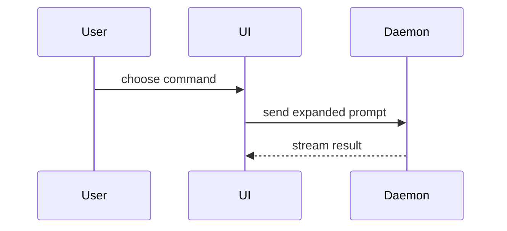

# zshow

会话内可视化讲解 skill:**跳过铺垫，用最小的图把当前话题讲清楚**——伪代码 / 调用树 / 组件树 / 文件树 / diff / Mermaid / 单文件 HTML。讲完即走，默认零沉淀。

## 何时触发
- 用户说"画个图讲讲"、"可视化解释"、"用图说明"、"图示一下"
- 讨论逻辑 / 流程 / 结构，纯文字说不清
- 用户看不懂某段控制流、数据流、改动范围

## 可视化菜单（挑最小的能讲清的那个）

### 逻辑 / 算法 → 伪代码

```text
on(save)
  if content is unchanged
    return cached result
  write new content
  return fresh result
```

### 运行时控制流 → 调用树

```text
submitForm
  createSession
    persistPrompt
    launchAgent
  navigateToSession
```

### UI 结构 → 组件树（含状态与模块边界）

```tsx
<SessionPage> (apps/example/src/routes/session.tsx)
  useSessionEvents()
  <SessionToolbar>
    <RunSkillButton> (packages/ui)
```

### 文件职责 / 大重构 → 浅文件树

```text
src/
├── commands/       # parses user actions
├── sessions/       # owns session state
└── transport/      # sends API requests
```

### 交互 / 控制流 / 数据流 → Mermaid



### 分支拓扑 / 合并事件 → Mermaid gitGraph


### 变化本身 → diff（形态随话题）

组件变化：

```diff
 <SessionPage>
   useSessionEvents()
   <SessionToolbar>
+    <RunSkillButton />
   <SessionTimeline>
+    <SkillResultCard />
```

文件布局变化：

```diff
 src/
 ├── commands/
+│   └── show-me.ts       # expands the slash command
 ├── sessions/
-└── transport.ts
+└── transport/
+    ├── client.ts
+    └── stream.ts
```

调用栈变化：

```diff
 submitForm
   createSession
     persistPrompt
+    expandSkillMention
     launchAgent
-  navigateToSession
+  navigateToSession
+    subscribeToEvents
```

状态 / 控制流变化：

```diff
 on(save)
-  write content
+  if content is unchanged
+    return cached result
+  write new content
+  invalidate cache
```

### 整块新代码 → 完整代码块

大半是新的、省略上下文会隐藏归属或顺序、或用户需要可复制的目标形态时：

```ts
function expandSkill(command: string): string {
  const skillName = command.slice(1)
  return `use the ${skillName} skill`
}
```

### 密集对比 / 概念 → 单文件 HTML

对可视化 UI、布局、状态对比或过于密集的概念——写一个聚焦的 HTML：图表、信息图或短幻灯片，贴合产品配色 / 字体 / 间距 / 组件，真实标签与数据，支持桌面与移动。落盘 `.zdev/show/show-me-<主题>.html`，把路径给用户。

## 边界
- **零沉淀默认**：伪代码 / 树 / diff / mermaid 一律内联会话，不写文件；仅 HTML 产物落 `.zdev/show/`，删留随意
- **与 zdraw 的边界**：zshow 是**即时讲解**（内联为主，交付的是"懂"）；zdraw 是**图资产交付**（excalidraw / drawio 可编辑源进仓库与报告）。需要可编辑源、品牌化或进报告的图 → zdraw
- 宁可少而准：一次最多几个视图，不 overwhelm 用户

## 资产
- 无 references；可视化菜单即规范
